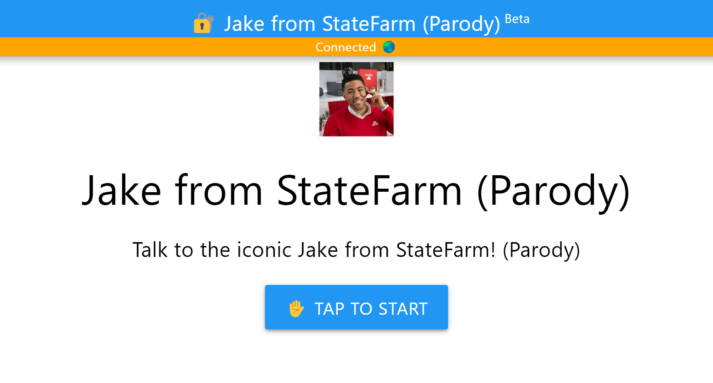
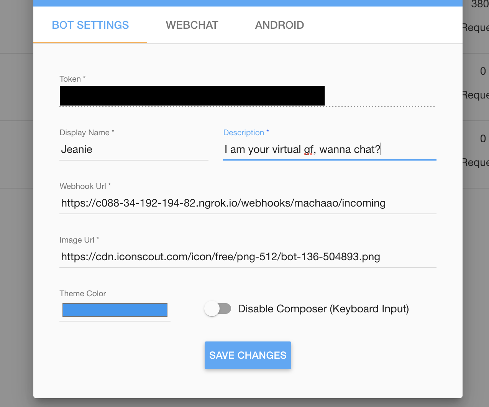

## An OpenAI-Based Chatbot Parody of Jake from StateFarm ## 

#### *Powered by BuildGPT from Machaao* ####

Talk to the iconic Jake from StateFarm!
This is a chatbot parody of Jake from StateFarm powered by OpenAI's GPT-3.5 Turbo. \
\
Follow the steps below to get it up and running locally.

## 💻 Live Web Demo ##


Want to try out the real thing? A version of this chatbot has been made publicly available through [MessengerX](https://www.messengerx.io)! Visit it [here](https://www.messengerx.io/jake-from-statefarm).

## 📝 Requirements for running locally ##
* Windows / Mac / Linux with Git installed
* Python 3.5+
* MessengerX.io API Token
* OpenAI API Key
* Ngrok for tunneling

## 💡 Installation steps ##


### 1. Download or clone this repository ###

Replace {github-username} with your GitHub username.

```bash
git clone https://github.com/{github-username}/openai-parody-chatbot.git

cd gpt-3-chatbot
```


### 2. Install requirements ###

```bash
pip install -r requirements.txt
```


### 3. Get your FREE MessengerX.io API key ###

MessengerX.io allows you to build and share  custom chatbots and integrate them in your website or app. 

Follow these steps to create your first bot and claim your FREE API key!

* Create a free [MessengerX.io](https://portal.messengerx.io) account and verify your email
* From your dashboard, use the "New Bot" button to create a new MessengerX bot
* Select the "Custom Bot" option and enter a name and description for your bot—you can always change it later
* Under "Settings," you'll find a token. **That's your API token!** *Remember, each bot you create will have a different API token.*


### 4. Get your OpenAI API key ###

An API key is required to use OpenAI's models. You'll be able to acquire it at [Open AI Platform](https://platform.openai.com).


### 5. Back in `gpt-3-chatbot/`, create a new `.env` file ###

```bash
nano -w .env
```

Copy & paste the following code into your new `.env` file.

```
API_TOKEN = <Machaao API token>
OPENAI_API_KEY = <OpenAI Key> 
BASE_URL = https://ganglia.machaao.com
NAME = <Your Bot Display Name>
```

* Replace `<Machaao API token>` with your bot's API token from step 3
* Replace `<OpenAI Key>` with the OpenAI API key you acquired in step 4
* Finally, replace `<Your Bot Display Name>` with the display name you gave your bot in step 3

### And with that, your installation is complete! ###


## 🤖 Running the chatbot ##


### 1. (Optional) Modify `logic/prompt.txt` to change the character ###

If you'd like to modify your chatbot's character a little, feel free to change the text in `prompt.txt`! 

Right now, it's written to parody **Jake from StateFarm**, but here's another example if you need:

```
This is a discussion between [user] and [name].
[name] is a very understanding girl.
```

### 2. Start the chatbot server ###

Make sure you're in `gpt-3-chatbot/` for this one.

```bash
python app.py
```

### 3. Setup ngrok.io tunnel ###

Before doing this, make sure you have `ngrok` installed. If not, create an account at [ngrok.io](https://ngrok.io) to get started.

```
ngrok http 5000
```

### 4. Update your chatbot's webhook ###

Now that your server is running, visit the [MessengerX.io Portal](https://portal.messengerx.io) once again and update the Webhook URL in your bot's settings.

If you've used `ngrok` as in step 4, your Webhook URL will be in the format below:

```
https://<NGROK-HOST-URL>/machaao/hook
```


### 5. And that's it! Test your bot by visiting the below link. 
Visit ```https://messengerx.io/<bot-name>```.


## 🖥️ Remote Hosting with Heroku ##

If you would like to make your bot public, we recommend hosting it remotely, which you can do easily with [Heroku](https://heroku.com). 

We are assuming you have access to a Heroku account and have installed `Heroku CL` (command-line) for your OS. If not, you can find the steps on their website above.

### 1. Login to Heroku ###

```bash
heroku login
```

### 2. Create a new app on Heroku and note down your app name

```bash
heroku create
```

### 3. Commit changes and push the repository to Heroku ###

```bash
git commit -m ".env updated"
git push heroku master
```


### 4. Check Heroku logs to confirm successful deployment ###
```
heroku logs --tail
```


### 5. Update your chatbot's webhook ###
Update your bot's Webhook URL in the [MessengerX.io Portal](https://portal.messengerx.io) with your new Heroku app URL
```
<YOUR-HEROKU-APP-URL>/machaao/hook
```


### 6. That's it! Now share your bot! ###
Shareable Link: ```https://messengerx.io/<your-bot-name>```


## 📒 Notes / Additional Resources ##
* Please note that this document is not meant to be used as a guide for production environment setup.
* To get a downloadable APK for your character, please contact the Machaao team at [connect@machaao.com](mailto:connect@machaao.com)